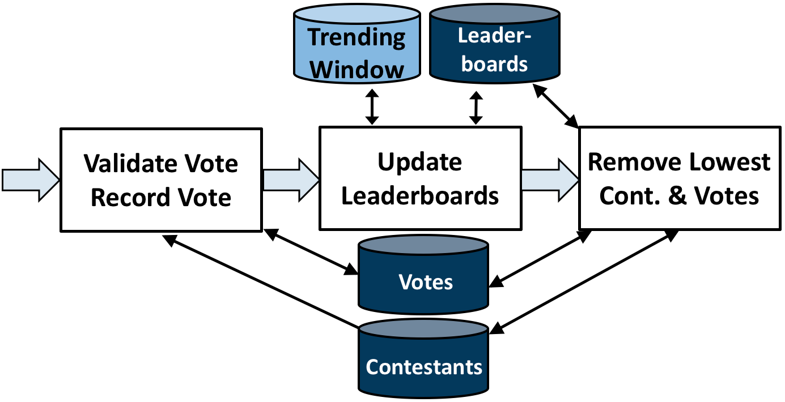

.. _benchmarks:

******************************************
Writing Applications/Benchmarks in S-Store
******************************************

The most common use of S-Store is the creation of applications, or benchmarks.  S-Store supports benchmarks with both streaming workloads and/or OLTP workloads.  

Creating a New Benchmark
------------------------

To begin creating a benchmark, please follow the instructions in the H-Store documentation, linked `here <http://hstore.cs.brown.edu/documentation/development/new-benchmark/>`_.  The high-level overview of these steps are below:

1. Create a **new directory** in the source tree under the src/benchmarks directory that will contain your benchmark. The high-level directory for your benchmark should contain a separate directory for the stored procedures. In the example shown below, the "votersstoreexample” benchmark is being created under the “edu.brown.benchmark” package:

.. code-block:: bash

	mkdir -p src/benchmarks/edu/brown/benchmark/votersstoreexample
	mkdir src/benchmarks/edu/brown/benchmark/votersstoreexample/procedures

.. Note:: More details listed here: `H-Store Setup <http://hstore.cs.brown.edu/documentation/development/new-benchmark/#setup>`_.

2. Add your benchmark to the **ProjectType** class, located in src/frontend/edu/brown/utils/ProjectType.java

.. code-block:: java

	public enum ProjectType {
		// "Benchmark Identifier" ("Benchmark Name", "Benchmark Package")
		VOTERSSTOREEXAMPLE ("VoterSStoreExample", "edu.brown.benchmark.votersstoreexample");
		...
	}

.. Note:: More details listed here: `H-Store ProjectType <http://hstore.cs.brown.edu/documentation/development/new-benchmark/#projectype>`_.

3. Create a **schema file** (DDL file) in your benchmark directory.  In votersstoreexample, the schema file is named votersstoreexample-ddl.sql

.. Note:: More details listed here: `H-Store Schema <http://hstore.cs.brown.edu/documentation/development/new-benchmark/#schema>`_.

4. Create **stored procedures** for your benchmark in the "procedures" folder created earlier.  These stored procedures will extend the VoltProcedure class.  They should contain parameterized SQL statements that are queued within the run(...) method.

.. Note:: More details listed here: `H-Store StoredProcedures <http://hstore.cs.brown.edu/documentation/development/new-benchmark/#storedprocedures>`_.

5. Create the **project builder** class, which will extend the AbstractProjectBuilder.  It will define 1) the benchmark's Data Loader class, 2) the benchmark's Client Driver class, 3) the default stored procedures that are included, and 4) the default partitioning scheme for the tables/windows/streams in the database.  The Data Loader and Client Driver class files must be defined in two static parameters m_clientClass and m_loaderClass, respectively.

.. Note:: In single-sited S-Store, the partitioning scheme used is not important, as all state will live on the same partition.  It is still recommended to include a partitioning scheme nonetheless. More details listed here: `H-Store ProjectBuilder <http://hstore.cs.brown.edu/documentation/development/new-benchmark/#projectbuilder>`_.

6. Create the **data loader**, which is used to populate the database with initial data before the benchmark begins.

.. Note:: More details listed here: `H-Store DataLoader <http://hstore.cs.brown.edu/documentation/development/new-benchmark/#dataloader>`_.

7. Create a **client driver** class, which will submit transaction requests at a rate specified at runtime.  This will be covered in further detail in the next section.

8. Create a **benchmark specification** file in properties/benchmarks/ that will be named [classname].properties.  By default, S-Store will look for the specification file in this directory based on the value of the project parameter.  This file needs to contain a single line, the location of the project builder class.  Here is the example of votersstoreexample.properties:

.. code-block:: java

	builder = edu.brown.benchmark.votersstoreexample.VoterSStoreExampleProjectBuilder

.. Note:: More details listed here: `H-Store Specification <http://hstore.cs.brown.edu/documentation/development/new-benchmark/#specification>`_.

While the core benchmark pieces, such as the schema, stored procedures, project builder, and client are fundamentally the same, there are some important differences between an S-Store workload that features dataflow graphs and an H-Store OLTP workload.  These differences are listed below.

Creating Batches and a Client
-----------------------------

S-Store executes and orders its dataflow processing in terms of batches.  A batch can be considered a group of one or more tuples that should be executed as a single, atomic unit.  Each batch includes a batch_id, which is associated with the time at which the batch arrived.  These batch_ids are attached to transactions incoming tuples are processed in order.  Batches and batch_ids are currently created on the client side.

Programming a client is very similar to the process described in the H-Store documentation (`H-Store Client <http://hstore.cs.brown.edu/documentation/development/new-benchmark/#clientdriver>`_.), but with some key differences.  There are two primary methods of ingesting data from the client to the engine.  The first method, similar to H-Store, is to generate new tuples directly within the client.  This method is best when data is fabricated, as the input rate can easily be controlled at runtime.  The second method is to use the StreamGenerator tool (documented here) to simulate an incoming stream.

The client consists of two major methods for repeatedly inserting new tuples into the engine: the runLoop() method and the runOnce() method.   Within the runOnce() method, the user can define a segment of code that runs x times per second, where x is defined by the -Dclient.txnrate parameter at runtime for each client.  An example can be found below:

.. code-block:: java

	static AtomicLong batchid = new AtomicLong(0); //monotonically-increasing batchid
				//increased when a new batch is created
	TupleGenerator tuplegenerator = new TupleGenerator(); //custom-designed tuple generator class for fabricating new tuples

	protected boolean runOnce() throws IOException {

		Client client = this.getClientHandle();
    	
		//create a new tuple, with a pre-defined schema
		Object tuple = tupleGenerator.createNewTuple();

		//asynchronous call for stream procedures
		boolean response = client.callStreamProcedure(callback, 
													"SP1", 
													batchid.getAndIncrement(),
													tuple.t_id,
													tuple.t_value);
		
		return response;
	}

The runLoop() method runs as one would expect a loop to: as many times as possible, with no hesitation.  runLoop() is best used with the streamgenerator, as it automatically ingests tuples at whatever rate the streamgenerator is producing them.  The easiest way to code in such a way that both the runOnce() and runLoop() method can be used is to place all of the inner loop code within runOnce(), and then call runOnce() repeatedly from within runLoop(), like so:

.. code-block:: java

	//to use "runLoop" instead of "runOnce," set the client.txnrate param to -1 at runtime
	public void runLoop() {
		try {
			while (true) {
				try {
				runOnce();
				} catch (Exception e) {
					failedTuples.incrementAndGet();
				}
			} // WHILE
		} catch (Exception e) { 
			e.printStackTrace();
		}
	}

As new tuples arrive, it is up to the client to group them into batches.  This can be done in several ways, but the easiest way is to create a String array with a size equal to the maximum number of tuples that you intend to send per batch.  In each iteration of the loop, the runOnce method takes in a new tuple and adds it to a batch.  When an entire batch is ready, that batch is submitted to the system by calling the client.callStreamProcedure(Callback, ProcName, Batch_Id, Tuples) method.  An example of this can be found below.

.. code-block:: java

	static AtomicLong batchid = new AtomicLong(0);

	protected boolean runOnce() throws IOException {
		String tuple = tuple_id + "," + tuple_value; //create tuple, DO NOT include a batch_id
		curTuples[i++] = tuple;
		if (BenchmarkConstants.NUM_PER_BATCH == i) { // We have a complete batch now.
			Client client = this.getClientHandle();
			boolean response = client.callStreamProcedure(callback, "SP1", batchid.getAndIncrement(), (Object[]) curTuples);
			i = 0;
			curTuples = new String[BenchmarkConstants.NUM_PER_BATCH];
		}
	}

runOnce()/runLoop() can easily be connected to the StreamGenerator using a clientSocket and BufferedInputStream, as shown below:

.. code-block:: java

	static AtomicLong batchid = new AtomicLong(0);

	public void runLoop() {
		Socket clientSocket = null;

		try {

			clientSocket = new Socket(BenchmarkConstants.STREAMINGESTOR_HOST, BenchmarkConstants.STREAMINGESTOR_PORT);
			clientSocket.setSoTimeout(5000);

			BufferedInputStream in = new BufferedInputStream(clientSocket.getInputStream());

			int i = 0;
			while (true) {
				int length = in.read();
				if (length == -1 || length == 0) { //end of input stream
					if (i > 0) {
						Client client = this.getClientHandle();
						boolean response = client.callStreamProcedure(callback, "SP1", batchid.getAndIncrement(), (Object[]) curTuples);
						i = 0;
					}
					break;
				}
				byte[] messageByte = new byte[length];
				in.read(messageByte);
				String tuple = new String(messageByte);
				curTuples[i++] = tuple;
				if (BenchmarkConstants.NUM_PER_BATCH == i) {
					// We have a complete batch now.
					Client client = this.getClientHandle();
					boolean response = client.callStreamProcedure(callback, "SP1", batchid.getAndIncrement(), (Object[]) curTuples);
					i = 0;
					curTuples = new String[BenchmarkConstants.NUM_PER_BATCH];
				}
			}
		} catch (Exception e) {
			e.printStackTrace();
		}
	}

Creating Tables, Windows, and Streams
-------------------------------------

As is the case in H-Store, application schemas are defined in a DDL file (`H-Store DDL <http://hstore.cs.brown.edu/documentation/development/new-benchmark/#schema>`_).  The DDL file must be named the same as your benchmark, followed by "-ddl.sql".

There are three primary types of state in S-Store applications: Tables, Streams, and Windows.  All three types of state are defined as tables, and all three are fully recoverable.

**Tables** constitute the primary "shared mutable state" of S-Store.  Any publicly writeable data (accessible to all OLTP or ad-hoc queries) should be defined in a table.  Creating tables is identical to both VoltDB and H-Store.  The table schema and any indexes are defined as in the example below:

.. code-block:: sql
	
	CREATE TABLE T1
	(
    	tuple_id	bigint    NOT NULL,
    	tuple_val	integer   NOT NULL,
    	CONSTRAINT PK_T1 PRIMARY KEY (tuple_id)
	);

.. Note:: Partition keys for tables are defined in the ProjectBuilder class.

**Streams** are the primary method of moving information from one stored procedure to another within a dataflow graph.  While the data is primarily passed through stored procedure arguments, it is important to also store the data in persistent streams as well for recovery purposes.  Streams are logically append and remove only.  For now, it is left to the application developer to prevent any updates to data items in a stream.  Stream creation is very similar to table creation. An example of a stream is shown below.  

.. code-block:: sql

	CREATE STREAM S1
	(
    	tuple_id	bigint    	NOT NULL,
    	tuple_val	integer   	NOT NULL,
    	batch_id 	bigint		NOT NULL
	);

.. Note:: Automatic garbage collection on Streams is left to future functionality.  The application developer should ensure that expired data items within Streams are garbage collected once the tuples are no longer needed (i.e. once the downstream SP has committed).

**Windows** hold a fixed quantity of data that updates as new data arrives.  Windows can be either **tuple-based**, meaning that they always hold a fixed number of tuples, or **batch-based**, meaning that they hold a fixed number of batches at any given time.  Windows update periodically as a specific quantity of tuples or batches arrive.  This is known as the window's **slide** value.

In order to create a window, the user must first create a stream that features the same schema as the window.  This stream must feature two columns to be used by the system, but not by the user: *WSTART* and *WEND*.  Both columns are to be left nullable, and should be of the INTEGER data type.  Aside from defining these columns, the user does not need to be concerned with them.  In the case of batch-based windows, the user must define a third column, *ts*, of the bigint data type.  This column corresponds with the batch-id, and determines when the window slides.  Unlike *WSTART* and *WEND*, the *ts* column must be managed by the user, and should be used as though it were a *batch_id* column. An example of this base stream is defined below:

.. code-block:: sql

	CREATE STREAM stream_for_win
	(
    	tuple_id 	bigint    	NOT NULL,
    	tuple_val 	integer    	NOT NULL,
    	ts 			bigint		NOT NULL,
    	WSTART		integer, --an integer column that is only used behind the scenes for window management
    	WEND		integer --an integer column that is only used behind the scenes for window management
	);

Once the template stream has been defined, the window can be defined based on that.  An example of a tuple-based window is below:

.. code-block:: sql

	CREATE WINDOW tuple_win ON stream_for_win ROWS [*number of rows*] SLIDE [*slide size*];

An example of a batch-based window is below:

.. code-block:: sql

	CREATE WINDOW batch_win ON stream_for_win RANGE [*number of batches*] SLIDE [*slide size*];

It is important to keep in mind that the window is its own separate data structure.  When inserting tuples into a window, they should be directly inserted into the window rather than the base stream.  Additionally, both the *WSTART* and *WEND* columns should be ignored during insert.  An example insert statement is shown below:

.. code-block:: java

	//insert into window
	public final SQLStmt insertProcTwoWinStmt = new SQLStmt(
		"INSERT INTO tuple_win (tuple_id, tuple_val, ts) VALUES (?,?,?);"
	);

Windows slides are handled automatically by the system, as the user would expect.  As new tuples/batches arrive, they are staged behind the scenes until enough tuples/batches arrive to slide the window by the appropriate amount.  Garbage collection is handled automatically, meaning that the user does ever need to manually delete tuples from a window.

.. Note:: In tuple-based window, no ordering is maintained within tuples in a batch.  This means that if a stored procedure is replayed upon recovery, the result may differ from the original value.  The results will remain consistent with our guarantees, however.

It is possible to attach an Execution Engine trigger to a window, as described below.  EE triggers execute on each window slide, not necessarily on each tuple insertion.

Creating OLTP Stored Procedures
-------------------------------

The primary unit of execution in S-Store are **stored procedures**.  Each execution of an S-Store stored procedure on an input batch results in a **transaction** with full ACID properties.  The definition of a stored procedure is very similar to that of H-Store Procedures (`H-Store Procedures <http://hstore.cs.brown.edu/documentation/development/new-benchmark/#storedprocedures>`_).  Constant SQL statements are defined and then submitted to the engine with parameters to be executed in batches.  An example of an OLTP stored procedure can be seen below.

.. code-block:: java

	@ProcInfo(
		partitionNum = 0; //states which partition this SP runs on
		singlePartition = true;
	)
	public class SP2 extends VoltProcedure {
		protected void toSetTriggerTableName()
		{
			addTriggerTable("proc_one_out");
		}

		public final SQLStmt getBatchId = "SELECT batch_id FROM proc_one_out ORDER BY batch_id LIMIT 1";

		public final SQLStmt getInputStream = "SELECT t_id, t_val FROM proc_one_out WHERE batch_id = ?;"; //define SQL statements here

		public final SQLStmt deleteInputStream = "DELETE * FROM proc_one_out WHERE batch_id = ?;";

		public final SQLStmt insertOutputStream = "INSERT INTO proc_two_out (t_id, t_val, batch_id) VALUES (?,?,?);"; //parameterized insert

		//the part of the stored procedure that actually runs on execution
		public long run(int part_id) {

			voltQueueSQL(getBatchId);
			VoltTable response = voltExecuteSQL();
			long batch_id = response[0].fetchRow(0).getLong("batch_id");

			//procedure work happens here
			voltQueueSQL(getInputStream, batch_id); //get tuples from the stream for the given batch_id
			voltQueueSQL(deleteInputStream, batch_id); //manually remove tuples from the stream
			response = voltExecuteSQL(); //returns results as an array of VoltTables

			//iterates through all rows of the response to the first query
			for(int i = 0; i < response[0].getRowCount()) {
				VoltTableRow row = response[0].fetchRow(i); //get the next row
				long t_id = row.getLong("t_id"); 
				int t_val = (int)row.getLong("t_val"); //integer is not an option, use "long" and cast

				//insert tuple into downstream
				voltQueueSQL(insertOutputStream, t_id, t_val+10, batch_id);
				voltExecuteSQL();
			}

			return BenchmarkConstants.SUCCESS;
		}
	}

There are a few things to note in this simple SP example.  First of all, the run(int part_id) method is standard, and should be included in every streaming SP.  The part_id parameter automatically uses the partitionNum, which is set in the @ProcInfo block at the top of the SP.

Again, currently stream maintenance is handled by the developer.  It is very important that the developer at the minimum 1) pull the most recent information from the input stream, 2) delete the same info from the input stream, and 3) insert new stream information into the output stream, if necessary.  Because single-node S-Store 

Creating Dataflow Graph Stored Procedures (Partition Engine Triggers)
---------------------------------------------------------------------

Like most streaming systems, the main method of programming a workload in S-Store is via **dataflow graphs**.  A dataflow graph in S-Store is a series of stored procedures which are connected via streams in a directed acyclic graph.  

By default, each stored procedure in a dataflow graph executes on each batch that arrives from the input.  When a stored procedure commits on an input batch, the S-Store scheduler automatically triggers a transaction execution of the downstream stored procedure.  For each stored procedure, batch *b* should commit before batch *b+1*, and for each batch, stored procedure *t* is guaranteed to commit before transaction *t+1*.  See the S-Store Engine section for more details on how this occurs and in what order the transactions will execute.

Dataflow graphs are defined as a series of triggering procedures, which are defined in each individual SP of the graph.  At the beginning of each dataflow SP, the user should define what input stream triggers this particular SP within the *toSetTriggerTableName()* function.  An example of this for *SP2* as listed below:

.. code-block:: java

	protected void toSetTriggerTableName() {
		addTriggerTable("proc_one_out"); //defines which stream will trigger this procedure, as a tuple is inserted into it
	}

.. Note: If multiple tuples are inserted within a single transaction (as is the case in a multiple-tuple batch), only a single downstream trigger invocation will result.

Dataflow stored procedures are required to take in a single parameter: 

*int* part_id - This parameter will automatically be filled in with the partitionNum ProcInfo parameter set at the beginning of the SP.  It is irrelevant for single-partition S-Store, but will be used in the distributed version.

Passing Data Along Streams using VoltStreams
--------------------------------------------

Stream data is passed from procedure to procedure using VoltStreams as arguments.  VoltStreams are attached to Stream tables that are defined in the DDL.  The stream tables used should include a *batch_id* column of long data type, in addition to whatever other schema is required.

As mentioned in the previous section, downstream stored procedures are activated with every transaction invocation.  This ensures that every SP executes for every batch_id, regardless of whether that batch contains new data that must be processed.

When data is being passed downstream, it must be inserted into a stream database object.  The downstream transaction should then find the earliest batch_id in the stream, and use that to read the batch from the same stream database object.  It should then manually perform garbage collection on the batch.  The SQL statements required for this are shown below.

.. code-block:: java

	public final SQLStmt getBatchId = "SELECT batch_id FROM proc_one_out ORDER BY batch_id LIMIT 1";
	public final SQLStmt getInputStream = "SELECT t_id, t_val FROM proc_one_out WHERE batch_id = ?;";
	public final SQLStmt deleteInputStream = "DELETE * FROM proc_one_out WHERE batch_id = ?;";

Then, those SQL statements can be executed in batches, using the following commands:

.. code-block:: java

	voltQueueSQL(getBatchId);
	VoltTable response = voltExecuteSQL();
	long batch_id = response[0].fetchRow(0).getLong("batch_id"); //finds the batch_id value

	voltQueueSQL(getInputStream, batch_id);
	voltQueueSQL(deleteInputStream, batch_id);
	response = voltExecuteSQL();

.. Note:: Garbage collection is not currently implemented for stream tables.  Tuples can be removed from the stream in the same transaction that is reading from it, as the transactions are guaranteed to either fully commit or rollback.

Execution Engine Triggers
-------------------------

**Execution Engine triggers** (also known as **EE triggers** or **backend triggers**) are SQL statements that are attached to tables, windows, or streams. These triggers execute the attached SQL code immediately upon the insertion of a tuple. Note that if a batch of many tuples is inserted with one command, the trigger will fire once for each insertion.

EE triggers are defined in a way that is similar to stored procedures. They are placed in the "procedures" package of the benchmark, and similarly declared within the ProjectBuilder class. Any EE trigger object extends the VoltTrigger class. The stream/window/table to which the trigger is attached must be defined by overriding the "toSetStreamName()" method, which will return the target object name.

.. code-block:: java

	protected String toSetStreamName() {
		return "s1";
	}

Each SQL statement that should be run upon tuple insert is then defined. These statements will run sequentially. Usually an "INSERT INTO...SELECT" statement will be used in order to somehow manipulate the data and push it downstream. Here is an example:

.. code-block:: java

	public final SQLStmt thisStmtName = new SQLStmt(
		"INSERT INTO sometable SELECT * FROM thisstream;"
	);

EE triggers have different semantics depending on what type of object they are attached to. For streams and tables, the triggers execute the attached SQL code immediately upon the insertion of a tuple. Note that if a batch of many tuples is inserted with one command, the trigger will fire once for each insertion. Tuples are automatically garbage collected once the attached SQL has finished running.

EE triggers attached to windows, however, operate differently. Rather than firing on the insertion of new tuples, the triggers instead fire on the sliding of the window. This is particularly useful for aggregating the contents of a window upon slide and pushing it into a downstream table or stream.

There are some limitations. EE triggers are unable to accept parameterized SQL statements, but both joins and aggregates can be used. Additionally, EE triggers are unable to activate a PE trigger. This means that if a tuple is inserted into a PE trigger stream directly from an EE trigger, the downstream stored procedure will not be activated.

