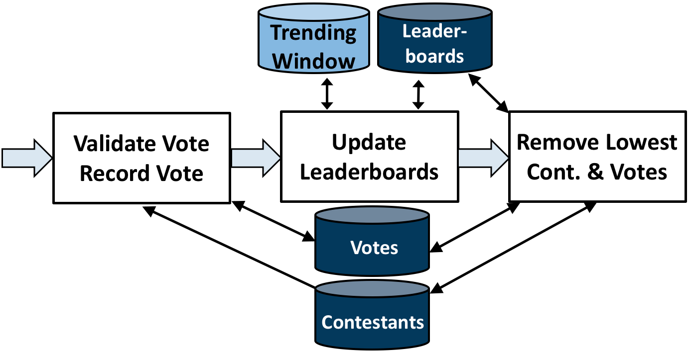

.. _intro:

****************************
Introduction to S-Store
****************************

What is S-Store?
----------------

S-Store is the world's first streaming OLTP engine, which seeks to seemlessly combine online transactional processing with push-based stream processing for real-time applications.  We accomplish this by designing our workloads as dataflow graphs of transactions, pushing the output of one transaction to the input of the next.

S-Store provides three fundamental guarantees, which together are found in no other system:

1) **ACID** - All updates to state are accomplished within ACID transactions

2) **Ordering** - S-Store executes on batches of data items, and ensures that batches are processed in an order consistent with their arrival.

3) **Exactly-once** - All operations are performed on data items once and only once, even in the event of failure

S-Store is designed for a variety of streaming use cases that involve shared mutable state, including real-time data ingestion, heartrate waveform analysis, and bicycle sharing applications, to name a few.

Transaction Model
-----------------

Like most streaming systems, S-Store models its workflows as a dataflow graph, a directed acyclic graph of operations.  Much like OLTP systems such as H-Store, operations in S-Store are modeled as stored procedures (SP).  Incoming tuples are grouped into batches, each of which must be executed as one atomic unit and ordered according to their arrival time.  When a stored procedure executes one of these batches, it creates a transaction execution (TE).  Transaction executions are fully ACID in their semantics, meaning that any state they touch are protected during execution and all changes are either committed or rolled back together.

In addition to these ACID semantics, S-Store ensures that each batch is executed in order according to their batch-ids.  For each stored procedure, a transaction execution of batch-id B is guaranteed to commit before the TE of batch-id B+1.  Similarly, for each batch-id B, stored procedure N is guaranteed to execute before stored procedure N+1, where N+1 is the next stored procedure downstream.  Each of these TEs is executed once and only once, even in the event of a failure.

To learn more about applications, the transaction model, and design of S-Store, please read our publications at `sstore.cs.brown.edu <https://sstore.cs.brown.edu/about.html>`_.

Architecture
------------

S-Store is built on top of H-Store, a distributed main-memory OLTP database.  You can read more about H-Store `here <https://hstore.cs.brown.edu>`_.  S-Store adds a number of streaming constructs to H-Store, including:

**Streams** - Append/delete data structures (queues) that push data from one piece of processing to another.  Streams allow data to be passed from one SP to another in a dataflow graph.

**Windows** - Shifting materialized views that display a fixed quantity of data and shift as new data arrives.  Windows can be either **tuple-based** (hold a fixed number of tuples) or **batch-based** (hold a fixed number of batches).  Each window contains a **slide** value, which indicates how frequently it updates (again, in terms of tuples or batches).

**Partition-Engine Triggers** - Also known as PE triggers, these are attached to streams such that they trigger transactions of downstream stored procedures, allowing for push-based dataflow graphs.

**Execution-Engine Triggers** - Also known as EE triggers, these are SQL statements attached to either windows or streams that execute when specific conditions are met (when new tuples are inserted for streams, and when the window slides in the case of windows).

At the moment, S-Store operates in single-node mode only, which means that there is no opportunity for parallelism.  The S-Store scheduler currently executes batches completely serially, meaning that an entire batch is processed to completion within the context of a dataflow graph before the next batch is started.

As a main-memory database, S-Store features disk-based command log-based recovery.  In case of failure, the user can replay S-Store's command logs in order to completely recreate the state of the system at the time of failure.

Running Example (Voter w/ Leaderboards)
---------------------------------------

S-Store comes with a number of benchmarks, including a simple streaming example meant to showcase the functionalities of S-Store.  This benchmark, votersstoreexample, mimics an online voting competition in which the audience votes for their favorite contestant, a sliding window is generated of the current leaderboard, and periodically, based on who has the least votes in that moment, a contestant is removed from the running.

This workload can be broken down into three stored procedures: Vote (collect the audience's votes), Generate Leaderboard (update the sliding window), and Delete Contestant (remove the lowest contestant every X votes).  